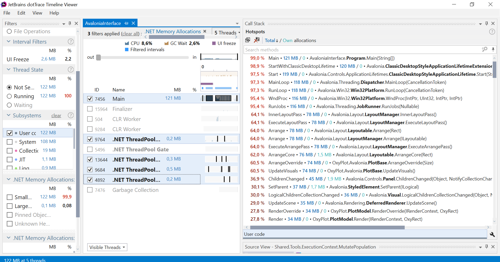
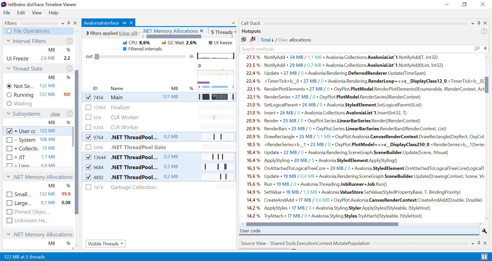
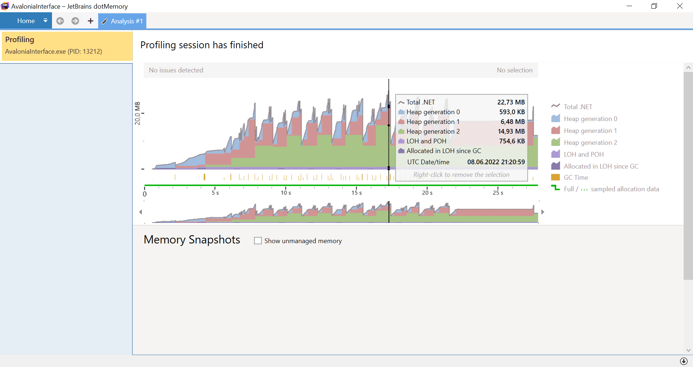
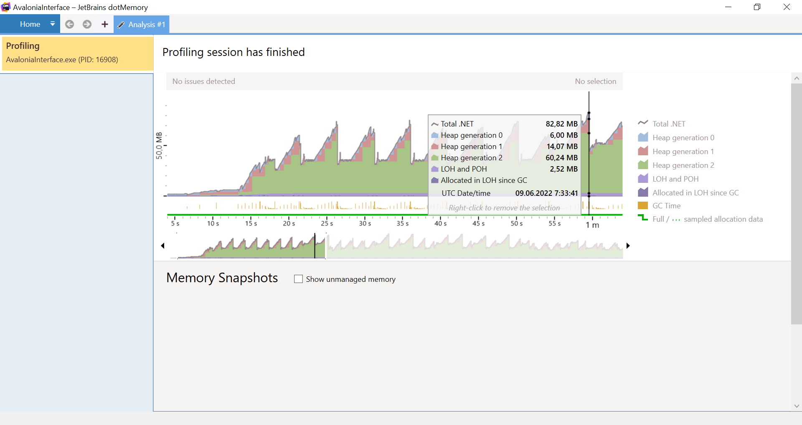

## Отчет по лабораторной работе № 4

1. <b>Описание задачи </b>

Мною был реализован генетический алгоритм при помощи которого, требовалось найти оптимальный путь точки на поле размером 1 x 1, обходя "запрещенные зоны". 

Моя реализация данного алгоритма имеет следующий вид: каждый раз мы случайным образом получаем следующую потенциальную точку движения особи и проверяем не выходит ли точка за пределы области и не попадает ли она в запрещенную область. Если же оба условия выполняются, то точка добавляется в следующее поколение. 

Когда мы собрали все поколение, мы начинаем его "мутацию". Считаем расстояния от каждой точки до точки (1, 1) - это является нашей фитнес-функцией. Далее находим 20% наиболее отдаленных особей и меняем их генотип на гены наилучшей(ближайшей к финишу) особи. 10% процентам из лучших особей мы так же делаем мутацию, что позволяет быстрее дойти до конца.

Так продолжается до тех пор пока не будет выполнено одно из условий: мы достигли ограничения по количеству поколений, либо же хоть одна точка попала в координаты (1,1).

2. <b> Снятие метрик </b>

Запуски производились при количестве особей равном 1000.

Как можно заметить наибольшие расходы ресурсов относятся к графическому шаблону на Avalonia, а именно к его внутренним компонентам, потребляют ресурсы в фоном режиме при запуске и самой работе. (рассматривается .NET Memory Allocations)

По итогам запуска тестов в dotMemory выидно, что в пике своей работы программа потребляет 22.73 MB. 

На данном графике видно, что при наличии 5000 особей (увеличили их количество в 5 раз) затраты памяти увеличилисб почти пропорционально.

Можно предположить, что "пики" выделения память - рассчет и генерация нового поколения.

Изначально, в процессе проектировки программы было принято решение хранить список всех посещенных точек и расстояние до финиша в каждом представителе популяции. Однако потом я заменил List< Point > на Point, таким образом мы храним только текущее местоположение каждой особи и значительно сокращаем расходы памяти. 

